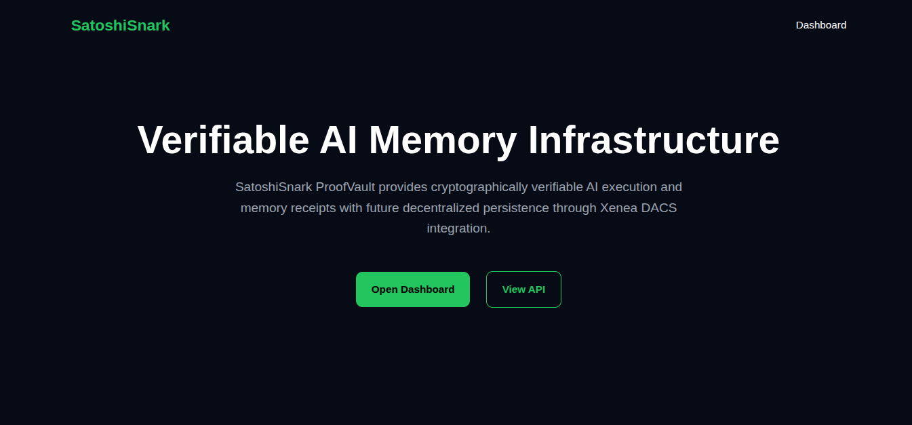
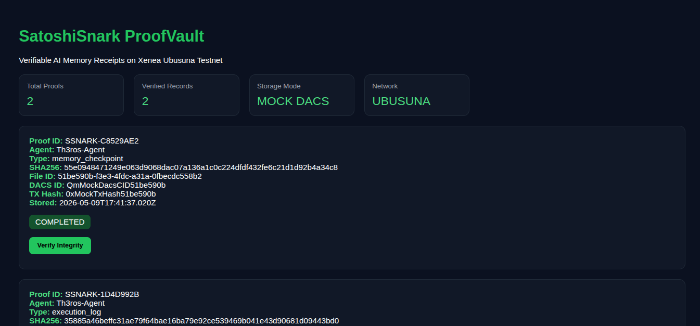
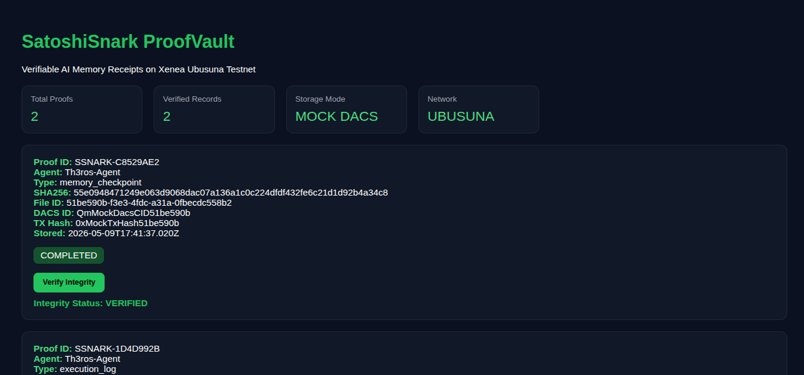

# SatoshiSnark ProofVault

Verifiable AI memory and execution infrastructure built for decentralized persistence and integrity validation on Xenea Ubusuna.

---

## Overview

SatoshiSnark ProofVault provides:

- AI memory notarization
- SHA256 integrity verification
- Tamper detection
- Persistent audit receipts
- Future-ready Xenea DACS integration
- Verifiable execution infrastructure for autonomous agents

The system converts AI execution outputs into cryptographically verifiable proof receipts.

---

## Screenshots

### Landing Page



---

### Dashboard



---

### Integrity Verification



---

## Core Features

### AI Memory Notarization
Generate immutable proof receipts for AI execution logs and memory checkpoints.

### Integrity Verification
Deterministic SHA256 verification engine detects tampering and validates stored records.

### Persistent Audit Trails
Store proof metadata including:
- proof IDs
- timestamps
- DACS references
- transaction hashes

### Dashboard Interface
Operational infrastructure dashboard for:
- proof monitoring
- verification
- audit visibility

### Future DACS Integration
Architecture prepared for decentralized persistence through Xenea DACS.

---

## API Endpoints

```bash
POST /api/notarize-memory

GET /api/proofs

GET /api/verify/:proofId

GET /api/health
```

---

## Architecture

```text
AI Agent
   ↓
ProofVault API
   ↓
SHA256 Integrity Layer
   ↓
Persistent Audit Storage
   ↓
Xenea DACS Persistence
```

---

## Current Status

### Implemented
- Backend API
- Proof generation
- SHA256 hashing
- Integrity verification
- Local persistence
- Dashboard UI
- Mock/live DACS abstraction

### In Progress
- Live DACS uploads
- Public deployment
- Domain integration
- Multi-agent support
- Distributed proof indexing

---

## Tech Stack

- Node.js
- Express
- SHA256 Cryptographic Hashing
- Xenea DACS SDK
- REST API Architecture
- HTML/CSS Dashboard UI

---

## Vision

SatoshiSnark ProofVault aims to become a verifiable infrastructure layer for autonomous AI systems by enabling cryptographically auditable execution and decentralized persistence of AI memory.
